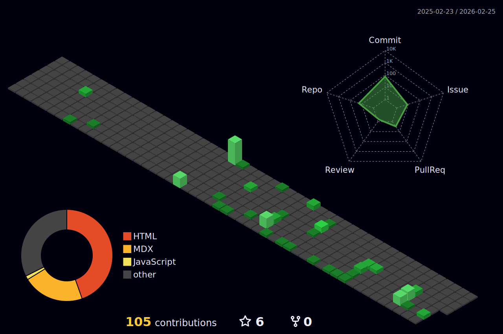

## 欢迎 👋

我是ClassIsBand，一个初中在读学生，我喜欢写一些有意思的小东西。

## 总览

  
更多信息…

## 项目

我创建的/我主要参与的项目：

- **[StickyHomeworks2/StickyHomeworks2 ](https://github.com/StickyHomeworks2/StickyHomeworks2/)**
   
  StickyHomeworks2 是一款支持富文本的桌面作业贴工具

## 开发

- 我主要使用的编程语言： 
  
  
- 我主要使用的框架： 
  
  
- 我主要使用的开发工具： 
  
  

## 与我联系

- 电子邮件（ClassIsland）：<wrc@classisland.tech>
- 电子邮件（其它）：<hello_wrc@outlook.com>

<!--
**HelloWRC/HelloWRC** is a ✨ _special_ ✨ repository because its `README.md` (this file) appears on your GitHub profile.

Here are some ideas to get you started:

- 🔭 I’m currently working on ...
- 🌱 I’m currently learning ...
- 👯 I’m looking to collaborate on ...
- 🤔 I’m looking for help with ...
- 💬 Ask me about ...
- 📫 How to reach me: ...
- 😄 Pronouns: ...
- ⚡ Fun fact: ...
-->
<!--
**belugaQAQ/belugaQAQ** is a ✨ _special_ ✨ repository because its `README.md` (this file) appears on your GitHub profile.

Here are some ideas to get you started:

- 🔭 I’m currently working on ...
- 🌱 I’m currently learning ...
- 👯 I’m looking to collaborate on ...
- 🤔 I’m looking for help with ...
- 💬 Ask me about ...
- 📫 How to reach me: ...
- 😄 Pronouns: ...
- ⚡ Fun fact: ...
-->
