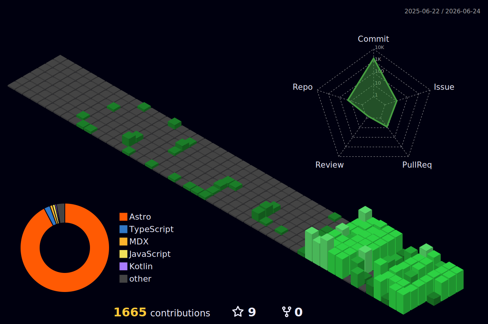

<h1>欢迎 👋 这里是ClassIsBand</h1>
一个初中在读学生，喜欢写一些有意思的小东西。
  

## 总览

## 项目

我创建的/我主要参与的项目：

- **[StickyHomeworks2/StickyHomeworks2 ](https://github.com/StickyHomeworks2/StickyHomeworks2/)**
   
  StickyHomeworks2 是一款支持富文本的桌面作业贴工具

- **[belugaQAQ/CamilaChineseWiki ](https://github.com/belugaQAQ/CamilaChineseWiki/)**

## 开发

- 我主要使用的编程语言： 
  
  
- 我主要使用的框架： 
  
  
- 我主要使用的开发工具： 
  
  

## 与我联系

- QQ ：2441500679
- 电子邮件（QQ）：<2441500679@qq.com>
- 电子邮件（其它）：<tb20121013@outlook.com>

